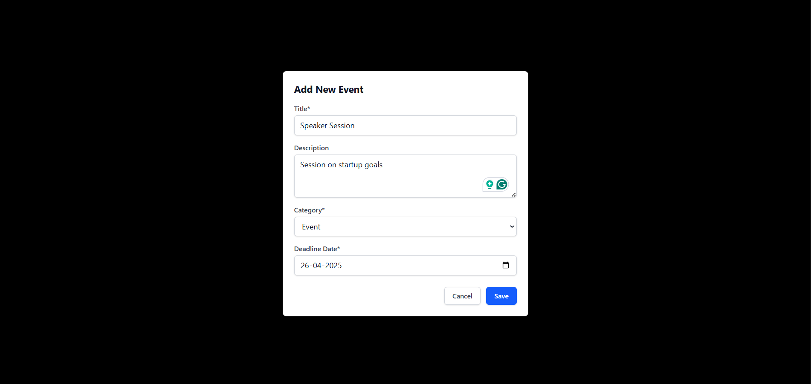
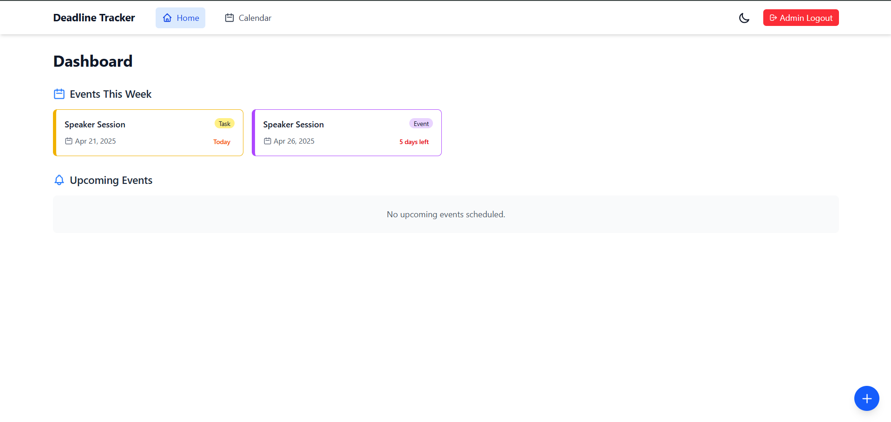
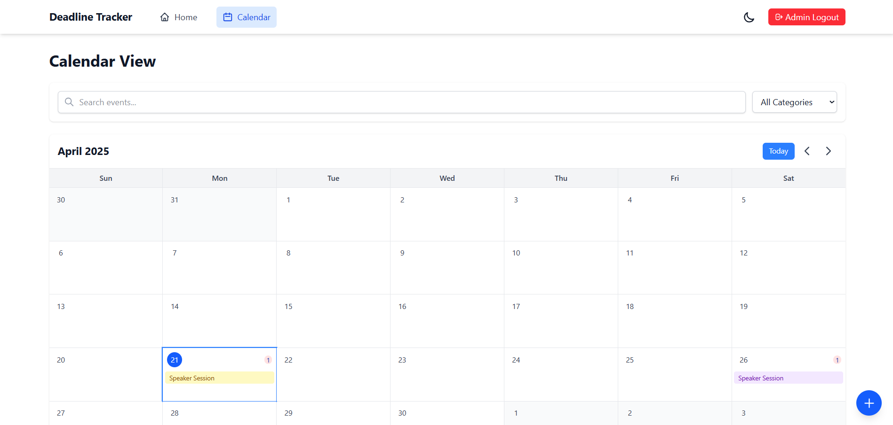
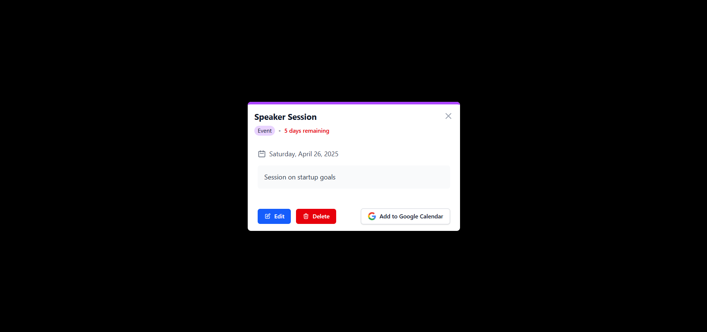

# Deadline Tracker 🚀

## Overview
Deadline Tracker is a powerful, user-friendly deadline management dashboard designed to help you track, and manage your important events, projects, and tasks hassle free! Stay up to date with task completion!

## 🌟 Features

### Deadline Management
- **Color-Coded Categories**: Visually distinguish between different types of events
- **Deadline Status**: Instant visibility into upcoming and past-due events

### User Experience
- **Responsive Design**: Seamless experience across desktop and mobile devices
- **Dark/Light Theme**: Customizable UI for comfortable viewing
- **Google Calendar Integration**: Sync events directly to your Google Calendar
- **Search and Filter**: Easily find specific events

### Admin Controls
- **Secure Admin Access**: Restricted event management capabilities
- **Comprehensive Event Tracking**: Add, edit, and delete events across multiple categories
- **Event Editing**: Modify event details with ease

## 🛠 Technical Stack
- **Frontend**: React
- **Styling**: Tailwind CSS
- **Routing**: React Router
- **State Management**: Context API
- **Responsive Design**: Mobile-first approach

## 🚀 Getting Started

### Prerequisites
- Node.js (v18+)
- npm

### Installation
1. Clone the repository
```bash
git clone https://github.com/Divii2205/deadlinetracker.git
```

2. Install dependencies
```bash
npm install
```

3. Start the development server
```bash
npm run dev
```

## 🔐 Admin Access
- **Default Admin Password**: `SSTadmin123`

## 📦 Project Structure
- `src/components/`: Reusable UI components
- `src/pages/`: Main application pages
- `src/context/`: Global state management
- `src/utils/`: Utility functions and helpers

## 🌈 Upcoming Features
- Advanced Notification System

## 📸 Screenshots




